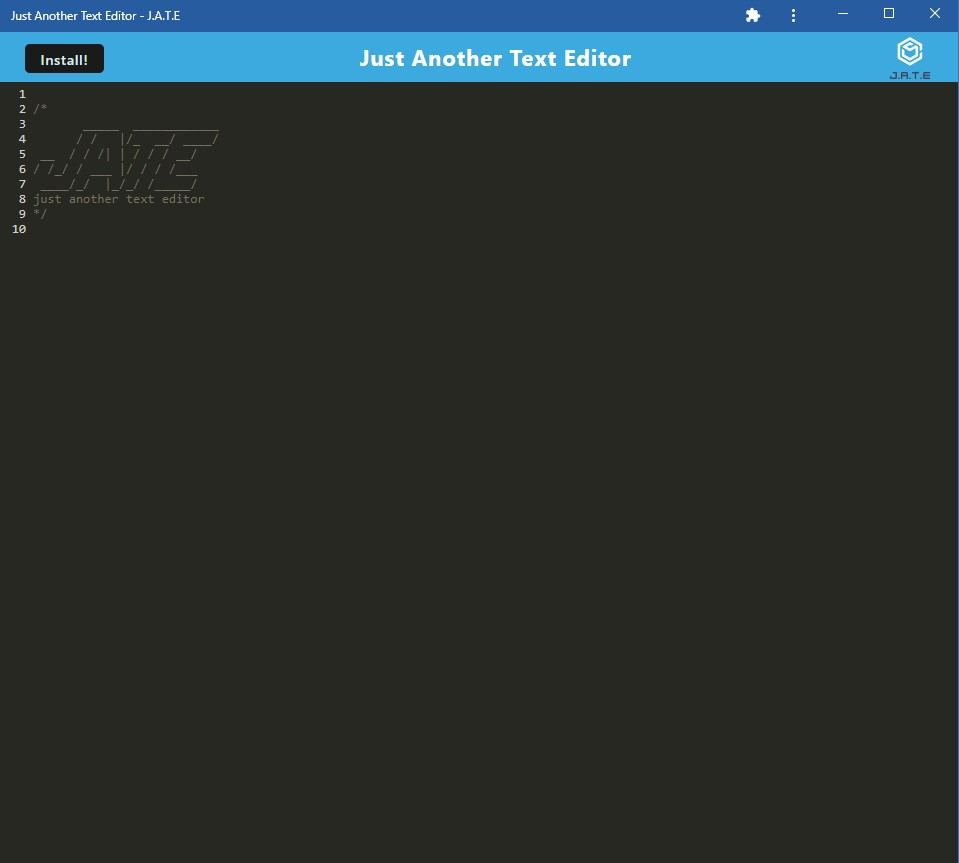

# PWA_Text_Editor

The application is a web text editor where the user can create notes or code snippets with or without an internet connection and where the user can reliably retrieve them for later use. The integrated service worker and Cache API's ensure that the application will remain fully functional even without and active internet connection. This application allows the user to access visited pages even if the application is offline.

## Technologies Used
* Javascript
* Webpack Workbox
* Concurrently
* IndexDB
* Express
* NodeJS
* Babel
* Nodemon

## Deployed Link
The link to the deployed application is at [Heroku website link](https://dashboard.heroku.com/apps/limitless-fjord-82509)

## Installation
`git clone` the repo to your local machine. To use this application, run the following command to install the dependencies: 

     `npm install`

## Usage
Type the following command in your termimal:

    `npm run start`

Then open a brower and type http://localhost:3000/ to run this application on your local machine.

You should see the JATE on your browser. See screenshot below:

You can also install the app on your local machine by clicking on the `Install!` button at the top-right corner.  Once complete you should see the app on your local drive. See screenshot below:

## License
This application is licensed under MIT license. 
